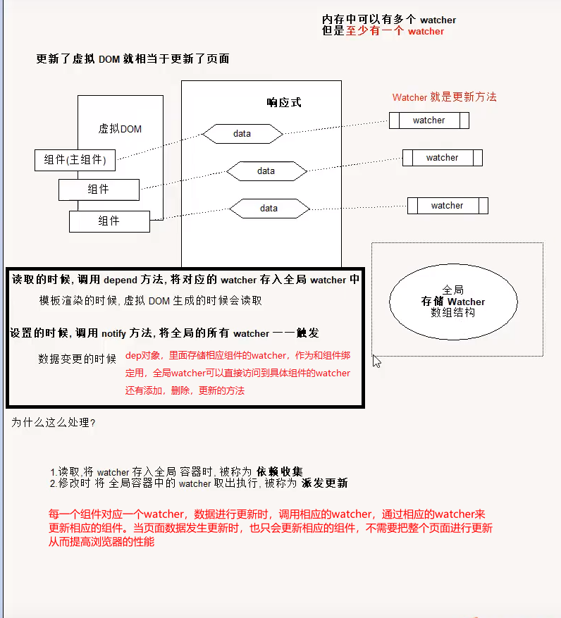
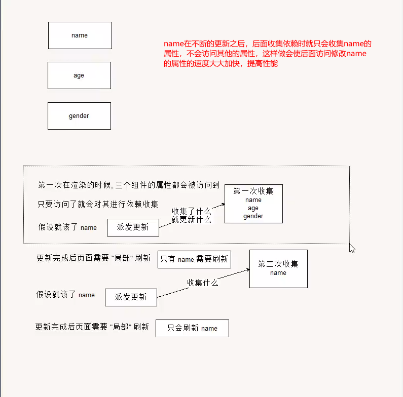

数据驱动


# Vue 与模板

使用步骤:

1. 编写 页面 模板 
   1. 直接在 HTML 标签中写 标签
   2. 使用 template
   3. 使用 单文件 ( <template /> )
2. 创建 Vue 的实例
   - 在 Vue 的构造函数中提供: data, methods, computed, watcher, props, ...
3. 将 Vue 挂载到 页面中 ( mount )

# 数据驱动模型

Vue 的执行流程

1. 获得模板: 模板中有 "坑"
2. 利用 Vue 构造函数中所提供的数据来 "填坑", 得到可以在页面中显示的 "标签了"
3. 将标签替换页面中原来有坑的标签

Vue 利用 我们提供的数据 和 页面中 模板 生成了 一个新的 HTML 标签 ( node 元素 ),
替换到了 页面中 放置模板的位置.


我们该怎么实现???


# 简单的模板渲染


# 虚拟 DOM

目标:

# 怎么将真正的 DOM 转换为 虚拟 DOM
  ### 1.创建虚拟DOM
   ```js
    class VNnode {
      //构造函数
      constructor(tag, data, value, type) {
        //标签名转小写
        this.tag = tag && tag.toLowerCase()
        this.data = data
        this.value = value
        this.type = type
        this.children = []

      }
      //追加子元素
      appendChild(vnode) {
        this.children.push(vnode)
      }
    }
   ```

   

  ### 2.生成虚拟DOM
    //使用递归来变量DOM元素，生成虚拟DOM
    //vue源码使用栈结构 ，用栈结构存储父元素来实现递归
   ```js
    function getVNode(node) {
      //获取节点类型
      let nodeType = node.nodeType

      let _vnode = null
      ///标签节点
      if (nodeType === 1) {
        let nodeName = node.nodeName
        //节点属性
        let attrs = node.attributes
        //获取data
        let _attrObj = {}
        //遍历所有节点
        for (let i = 0; i < attrs.length; i++) {
          _attrObj[attrs[i].nodeName] = attrs[i].nodeValue
        }
        //nodeName标签名 ,_attrObj 属性 第三位value  nodeType 标签类
        _vnode = new VNnode(nodeName, _attrObj, undefined, nodeType)
        //node的子节点
        let childNodes = node.childNodes
        console.log(childNodes)
        for (let i = 0; i < childNodes.length; i++) {
          _vnode.appendChild(getVNode(childNodes[i]))
        }

      }
      //文本节点
      else if (nodeType === 3) {
        _vnode = new VNnode(undefined, undefined, node.nodeValue, nodeType)


      }
      return _vnode
    }
   ```


​    
# 怎么将虚拟 DOM 转换为 真正的 DOM
  # 3.将虚拟DOM生成真正的DOM
    //逆转第二步骤
   ```js
    function parseVNode(vnode) {
      //获取类型
      let type = vnode.type
      //保存标签名
      let _node = null
      //文本节点
      if (type === 3) {
        return document.createTextNode(vnode.value) //创建文本节点
      }
      else if (type === 1) {   //元素节点
        _node = document.createElement(vnode.tag)  // 创建元素标签名
        //1.属性
        let data = vnode.data  //data此时为键值对 即还原 class = 'value'
        Object.keys(data).forEach((key) => {
          let attrName = key  //属性名
          let attrValue = data[key]  //属性值
          //绑定标签的属性值
          _node.setAttribute(attrName, attrValue)
        })
        //2.子节点
        let children = vnode.children
        console.log(children)
        //遍历子节点 ,子节点此时为虚拟DOM
        children.forEach(subvnode => {
          _node.appendChild(parseVNode(subvnode))  //调用转换真实DOM函数,递归转换为子元素
        })
        return _node;
      }

    }
   ```


 # vue二次提交思路
   每次生成虚拟DOM1之前还会生成一个新的虚拟DOM2
   * 这个新的虚拟DOM2用来响应页面数据发生改变，，每发生一次数据改变就会生成一个新的虚拟DOM2 (缓存的是抽象语法树AST)
         到时会生成多个虚拟DOM,因为js是底层决定了数据数据发生改变就必须重新渲染页面
   * 这里vue将js的机制放到内存中,并且利用了二次提交(生成两种虚拟DOM)
         生成的多个虚拟DOM利用diff算法比较虚拟DOM1和虚拟DOM2之间的不同 
   * 等所有的所有的虚拟DOM2都提交了不同,然后进行更新虚拟DOM1
         最后虚拟DOM1只要提交一次即可更新所有在真实DOM上的数据   
   * 见图解
   *   
   * 

     
    
      //将带坑的vnode与数据(data)进行结合 ,得到填充数据的VNode:,模拟AST+data =>VNode
  ```js
      
    function combine(vnode, data) {
      this._type = vnode.type
      this._data = vnode.data
      this._value = vnode.value
      this._tag = vnode.tag
      this._children = vnode.children

      let _vnode = null
      if (_type === 3) {  //文本节点
        //处理文本
        _value = _value.replace(rkuohao, function (_, g) {
          return getValurBypath(data, g.trim());
        });

        _vnode = new VNnode(_tag, _data, _value, _type)

      } else if (_type === 1) {//元素节点
        _vnode = new VNnode(_tag, _data, _value, _type)
        _children.forEach(_subVnode => _vnode.appendChild(combine(_subVnode, data)))
      }
      return _vnode
    }
  ```
  # 模拟vue从真实的DOM 到生成虚拟DOM2 再到提交到虚拟DOM1 最后渲染到页面
  ```js
   function JGvue(options) {
      this._data = options.data
      let elem = document.querySelector(options.el)//这里直接用DOM  vue里面是字符串
      this._template = elem
      this._parent = elem.parentNode
      this.mount()  //挂载方法
    }
    JGvue.prototype.mount = function () {

      //渲染函数
      //需要提供一个render方法 用来生成虚拟DOM
      this.render = this.createRenderFn()

      this.mountComponent()

    }
    
    JGvue.prototype.mountComponent = function () {
      //执行mountComponent
      let mount = () => {
        this.update(this.render())
      }
      mount.call(this)
    }
    //   //创建渲染函数 ,目的是为了缓存抽象语法书（ast) 这里用虚拟DOM来实现
    JGvue.prototype.createRenderFn = function () {

      let ast = getVNode(this._template)
      // vue: AST  + data 生成 虚拟DOM(Vnode)
      // 这里用带坑的Vnode + data   生成Vnode
      return function render() {

        let _tmp = combine(ast, this._data)

        return _tmp

      }

    }
    //将DOM渲染到页面中
    JGvue.prototype.update = function (vnode) {
      //生成真实DOM
      let realDOM = parseVNode(vnode)
      // debugger
      // let _ = 0
      //渲染到页面上 父元素替换子元素
      this._parent.replaceChild(realDOM, document.querySelector('#root'))


    }
  ```
思路与深拷贝类似


# 函数科里化

参考资料:

- [函数式编程](https://llh911001.gitbooks.io/mostly-adequate-guide-chinese/content/)
- [维基百科](https://zh.wikipedia.org/wiki/%E6%9F%AF%E9%87%8C%E5%8C%96)

概念:

1. 科里化: 一个函数原本有多个参数, 之传入**一个**参数, 生成一个新函数, 由新函数接收剩下的参数来运行得到结构.
2. 偏函数: 一个函数原本有多个参数, 之传入**一部分**参数, 生成一个新函数, 由新函数接收剩下的参数来运行得到结构.
3. 高阶函数: 一个函数**参数是一个函数**, 该函数对参数这个函数进行加工, 得到一个函数, 这个加工用的函数就是高阶函数.

为什么要使用科里化? 为了提升性能. 使用科里化可以缓存一部分能力.

使用两个案例来说明:

1. 判断元素
2. 虚拟 DOM 的 render 方法

1. 判断元素: 

Vue 本质上是使用 HTML 的字符串作为模板的, 将字符串的 模板 转换为 AST, 再转换为 VNode.

- 模板 -> AST
- AST -> VNode
- VNode -> DOM

那一个阶段最消耗性能?

最消耗性能是字符串解析 ( 模板 -> AST )

例子: let s = "1 + 2 * ( 3 + 4 * ( 5 + 6 ) )"
写一个程序, 解析这个表达式, 得到结果 ( 一般化 )
我们一般会将这个表达式转换为 "波兰式" 表达式, 然后使用栈结构来运算

在 Vue 中每一个标签可以是真正的 HTML 标签, 也可以是自定义组件, 问怎么区分???

在 Vue 源码中其实将所有可以用的 HTML 标签已经存起来了.

假设这里是考虑几个标签:

```js
let tags = 'div,p,a,img,ul,li'.split(',');
```

需要一个函数, 判断一个标签名是否为 内置的 标签

```js
function isHTMLTag( tagName ) {
  tagName = tagName.toLowerCase();
  if ( tags.indexOf( tagName ) > -1 ) return true;
  return false;
}
```

模板是任意编写的, 可以写的很简单, 也可以写到很复杂, indexOf 内部也是要循环的

如果有 6 中内置标签, 而模板中有 10 个标签需要判断, 那么就需要执行 60 次循环


2. 虚拟 DOM 的 render 方法

思考: vue 项目 *模板 转换为 抽象语法树* 需要执行几次??? 

- 页面一开始加载需要渲染
- 每一个属性 ( 响应式 ) 数据在发生变化的时候 要渲染
- watch, computed 等等

我们昨天写的代码 每次需要渲染的时候, 模板就会被解析一次 ( 注意, 这里我们简化了解析方法 )

render 的作用是将 虚拟 DOM 转换为 真正的 DOM 加到页面中

- 虚拟 DOM 可以降级理解为 AST
- 一个项目运行的时候 模板是不会变 的, 就表示 AST 是不会变的

我们可以将代码进行优化, 将 虚拟 DOM 缓存起来, 生成一个函数, 函数只需要传入数据 就可以得到 真正的 DOM


## 讨论

- 这样的闭包会内存泄漏吗老师?
  - 性能一定是会有问题
  - 尽可能的提高性能
- 原生的好多东西都忘记了，不知道从哪学起？


# 问题

问题:

- 没明白柯里化怎么就只要循环一次。昨天 讲的 
  - **缓存一部分行为**
- mountComponent 这个函数里面的内容 没太理解 ( 具体 )
- call


makeMap( [ 'div', 'p' ] ) 需要遍历这个数据 生成 键值对 

```
let set = {
  div: true
  p: true
}

set[ 'div' ] // ture

set[ 'Navigator' ] // undefined -> false
```

但是如果是使用的函数, 每次都需要循环遍历判断是不是数组中的


# 响应式原理

- 我们在使用 Vue 时候, 赋值属性获得属性都是直接使用的 Vue 实例
- 我们在设计属性值的时候, 页面的数据更新

```js
Object.defineProperty( 对象, '设置什么属性名', {
  writeable
  configurable
  enumerable:  控制属性是否可枚举, 是不是可以被 for-in 取出来
  set() {}  赋值触发
  get() {}  取值触发
} )
```

```js
// 简化后的版本
function defineReactive( target, key, value, enumerable ) {
  // 函数内部就是一个局部作用域, 这个 value 就只在函数内使用的变量 ( 闭包 )
   if ( typeof value === 'object' && value != null && !Array.isArray( value ) ) {
        // 是非数组的引用类型
        reactify( value ); // 递归
      }

  Object.defineProperty( target, key, {
    configurable: true,
    enumerable: !!enumerable,

    get () {
      console.log( `读取 o 的 ${key} 属性` ); // 额外
      return value;
    },
    set ( newVal ) {
      console.log( `设置 o 的 ${key} 属性为: ${newVal}` ); // 额外
      value = newVal;
    }
  } )
}
```


实际开发中对象一般是有多级

```js
let o = {
  list: [
    {  }
  ],
  ads: [
    { }
  ],
  user: {

  }
}
```

怎么处理呢??? 递归
# 对象的数据响应化
```js
// 将对象 o 响应式化
    function reactify( o ) {
      let keys = Object.keys( o );

      for ( let i = 0; i < keys.length; i++ ) {
        let key = keys[ i ]; // 属性名
        let value = o[ key ];
        // 判断这个属性是不是引用类型, 判断是不是数组
        // 如果引用类型就需要递归, 如果不是就不用递归
        //  如果不是引用类型, 需要使用 defineReactive 将其变成响应式的
        //  如果是引用类型, 还是需要调用 defineReactive 将其变成响应式的
        // 如果是数组呢? 就需要循数组, 然后将数组里面的元素进行响应式化
        if ( Array.isArray( value ) ) {
          // 数组
          for ( let j = 0; j < value.length; j++ ) {
            reactify( value[ j ] ); // 递归
          }
        } else {
          // 对象或值类型
          defineReactive( o, key, value, true );
        }
      }
    }
```
# 数组的数据响应化
对于对象可以使用 递归来响应式化, 但是数组我们也需要处理

- push
- pop
- shift
- unshift
- reverse
- sort
- splice

要做什么事情呢?
```js
 //改写数组 ,让数组也可以实现响应式
    //思路,原型链的继承
    let arr = []
    //继承关系: arr -> Array.prototyep ->Object.prototype
    //重新继承关系:arr -> 改写的方法 ->  Array.prototype->Object.prototype

    //新建一个对象 继承至Array.prototype  下面就是arr指向这个对象
    let array_methods = Object.create(Array.prototype)

    ARRAY_METHOD.forEach(method => {
      array_methods[method] = function () {
        //调用原来的方法,改写this指向
        // console.log('调用的是' + method + '方法')
         //数据响应化
        for (let i = 0; i < arguments.length; i++) {
          reactify(arguments[i])
        }
        let res = Array.prototype[method].apply(this, arguments)
        return res
      }
    })
    //将arr的隐式原型链指向arr_methods
    arr.__proto__ = array_methods
```

1. 在改变数组的数据的时候, 要发出通知
   - Vue 2 中的缺陷, 数组发生变化, 设置 length 没法通知 ( Vue 3 中使用 Proxy 语法 ES6 的语法解决了这个问题 )

2. 加入的元素应该变成响应式的

技巧: 如果一个函数已经定义了, 但是我们需要扩展其功能, 我们一般的处理办法:

1. 使用一个临时的函数名存储函数
2. 重新定义原来的函数
3. 定义扩展的功能
4. 调用临时的那个函数


扩展数组的 push 和 pop 怎么处理呢???

- 直接修改 prototype **不行**
- 修改要进行响应式化的数组的原型 ( __proto__ )

已经将对象改成响应式的了. 但是如果直接给对象赋值, 赋值另一个对象, 那么就不是响应式的了, 怎么办? ( 作业 )

```
// 继承关系: arr -> Array.prototype -> Object.prototype -> ...
// 继承关系: arr -> 改写的方法 -> Array.prototype -> Object.prototype -> ...
```


# 发布订阅模式

任务:

- 作业
- 代理方法 ( app.name, app._data.name )
- 事件模型 ( node: event 模块 )
- vue 中 Observer 与 Watcher 和 Dep

代理方法, 就是要将 app._data 中的成员 给 映射到 app 上 

由于需要在更新数据的时候, 更新页面的内容
所以 app._data 访问的成员 与 app 访问的成员应该时同一个成员

由于 app._data 已经是响应式的对象了, 所以只需要让 app 访问的成员去访问 app._data 的对应成员就可以了.

例如:

```js
app.name 转换为 app._data.name
app.xxx 转换为 app._data.xxx
```

引入了一个函数 proxy( target, src, prop ), 将 target 的操作 映射到 src.prop 上
这里是因为当时没有 `Proxy` 语法 ( ES6 )

我们之前处理的 rectify 方法已经不行了, 我们需要一个新的方法来处理

提供一个 Observer 的方法, 在方法中对 属性进行处理
可以将这个方法封装发到 initData 方法中


## 解释 proxy

```js
app._data.name
// vue 设计, 不希望访问 _ 开头的数据
// vue 中有一个潜规则:
//  - _ 开头的数据是私有数据
//  - $ 开头的是只读数据
app.name
// 将 对 _data.xxx 的访问 交给了 实例

// 重点: 访问 app 的 xxx 就是在访问 app._data.xxx
```

假设:

```js
var  o1 = { name: '张三' };
// 要有一个对象 o2, 在访问 o2.name 的时候想要访问的是 o1.name
Object.defineProperty( o2, 'name', {
  get() {
    return o1.name
  }
} );
```

访问 app 的 xxx 就是在访问 app._data.xxx

```js
Object.defineProperty( app, 'name', {
  get() {
    return app._data.name
  },
  set( newVal ) {
    app._data.name = newVal;
  }
} )
```

将属性的操作转换为 参数

```js
function proxy( app, key ) {
  Object.defineProperty( app, key, {
    get() {
      return app._data[ key ]
    },
    set( newVal ) {
      app._data[ key ] = newVal;
    }
  } )
}
```

问题: 

在 vue 中不仅仅是只有 data 属性, properties 等等 都会挂载到 Vue 实例上

```js
function proxy( app, prop, key ) {
  Object.defineProperty( app, key, {
    get() {
      return app[ prop ][ key ]
    },
    set( newVal ) {
      app[ prop ][ key ] = newVal;
    }
  } )
};

// 如果将 _data 的成员映射到 实例上
proxy( 实例, '_data', 属性名 )
// 如果要 _properties 的成员映射到 实例上
proxy( 实例, '_properties', 属性名 )
```

# 发布订阅模式

目标: 解耦, 让各个模块之间没有紧密的联系

现在的处理办法是 属性在更新的 时候 调用 mountComponent 方法. 

问题: mountComponent 更新的是什么??? (现在) 全部的页面 -> 当前虚拟 DOM 对应的页面 DOM

在 Vue 中, 整个的更新是按照组件为单位进行 **判断**, 已节点为单位进行更新.

- 如果代码中没有自定义组件, 那么在比较算法的时候, 我们会将全部的模板 对应的 虚拟 DOM 进行比较.
- 如果代码中含有自定义组件, 那么在比较算法的时候, 就会判断更新的是哪一些组件中的属性, 只会判断更新数据的组件, 其他组件不会更新.

复杂的页面是有很多组件构成. 每一个属性要更新的都要调用 更新的方法?

**目标, 如果修改了什么属性, 就尽可能只更新这些属性对应的页面 DOM**

这样就一定不能将更新的代码写死.

例子: 预售可能一个东西没有现货, 告诉老板, 如果东西到了 就告诉我. 

老板就是发布者
订阅什么东西作为中间媒介
我就是订阅者

使用代码的结构来描述:

1. 老板提供一个 账簿( 数组 )
2. 我可以根据需求订阅我的商品( 老板要记录下 谁 定了什么东西, 在数组中存储 某些东西 )
3. 等待, 可以做其他的事情
4. 当货品来到的时候, 老板就查看 账簿, 挨个的打电话 ( 遍历数组, 取出数组的元素来使用 )

实际上就是事件模型

1. 有一个 event 对象
2. on, off, emit 方法

实现事件模型, 思考怎么用?

1. event 是一个全局对象
2. event.on( '事件名', 处理函数 ), 订阅事件
   1. 事件可以连续订阅
   2. 可以移除: event.off()
      1. 移除所有
      2. 移除某一个类型的事件
      3. 移除某一个类型的某一个处理函数
3. 写别的代码
4. event.emit( '事件名', 参数 ), 先前注册的事件处理函数就会依次调用

原因:

1. 描述发布订阅模式
2. 后面会使用到事件


发布订阅模式 ( 形式不局限于函数, 形式可以是对象等 ) :

1. 中间的**全局的容器**, 用来**存储**可以被触发的东西( 函数, 对象 )
2. 需要一个方法, 可以往容器中**传入**东西 ( 函数, 对象 )
3. 需要一个方法, 可以将容器中的东西取出来**使用**( 函数调用, 对象的方法调用 )

Vue 模型

页面中的变更 ( diff ) 是一组件为单位

- 如果页面中只有一个组件 ( Vue 实例 ), 不会有性能损失
- 但是如果页面中有多个组件 ( 多 watcher 的一种情况 ), 第一次会有 多个组件的 watcher 存入到 全局watcher 中.
  - 如果修改了局部的数据( 例如其中一个组件的数据 )
  - 表示只会对该组件进行 diff 算法, 也就是说只会重新生成该组件的 抽象语法树
  - 只会访问该组件的 watcher
  - 也就表示再次往全局存储的只有该组件的 watcher
  - 页面更新的时候也就只需要更新一部分
  - 


# 改写 observe 函数

缺陷:

- 无法处理数组
- 响应式无法在中间集成 Watcher 处理
- 我们实现的 rectify 需要和实例紧紧的绑定在一起, 分离 ( 解耦 )

## 问题

- observe  还没对单独的数组元素做处理吧? 


# 引入 Watcher

问题:

- 模型 ( 图 )
- 关于 this 的问题


实现:

分成两步:

1. 只考虑修改后刷新 ( 响应式 )
2. 再考虑依赖收集 ( 优化 )


在 Vue 中提供一个构造函数 Watcher
Watcher 会有一些方法: 

- get() 用来进行**计算**或**执行**处理函数
- update() 公共的外部方法, 该方法会触发内部的 run 方法
- run() 运行, 用来判断内部是使用异步运行还是同步运行等, 这个方法最终会调用内部的 get 方法
- cleanupDep() 简单理解为清除队列

我们的页面渲染是上面那一个方法执行的呢???

我们的 watcher 实例有一个属性 vm, 表示的就是 当前的 vue 实例


# 引入 Dep 对象

该对象提供 依赖收集 ( depend ) 的功能, 和 派发更新 ( notify ) 的功能

在 notify 中去调用 watcher 的 update 方法


# Watcher 与 Dep

之前将 渲染 Watcher 放在全局作用域上, 这样处理是有问题的

- vue 项目中包含很多的组件, 各个组件是**自治**
  - 那么 watcher 就可能会有多个
  - 每一个 watcher 用于描述一个渲染行为 或 计算行为
    - 子组件发生数据的更新, 页面需要重新渲染 ( 真正的 Vue 中是**局部**渲染 )
    - 例如 vue 中推荐是使用 计算属性 代替复杂的 插值表达式.
      - 计算属性是会伴随其使用的属性的变化而变化的
      - `name: () => this.firstName + this.lastName` 
        - 计算属性 依赖于 属性 firstName 和 属性 lastName
        - 只要被依赖的属性发生变化, 那么就会促使计算属性 **重新计算** ( Watcher )
        - 
- 依赖收集与派发更新是怎么运行起来的
- 

**我们在访问的时候 就会进行收集, 在修改的时候就会更新, 那么收集什么就更新什么**

所谓的依赖收集 **实际上就是告诉当前的 watcher 什么属性被访问了**, 
那么在这个 watcher 计算的时候 或 渲染页面的时候 就会 将这些收集到的属性进行更新.


如何将 属性与 当前 watcher 关联起来??

- 在全局 准备一个 targetStack ( watcher 栈, 简单的理解为 watcher "数组", 把一个操作中需要使用的 watcher 都存储起来 )
- 在 Watcher 调用 get 方法的时候, 将当前 Watcher 放到全局, 在 get 之前结束的时候(之后), 将这个 全局的 watcher 移除. 提供: pushTarget, popTarget
- 在每一个属性中 都有 一个 Dep 对象


我们在访问对象属性的时候 ( get ), 我们的渲染 watcher 就在全局中.
将 属性与 watcher 关联, 其实就是将当前渲染的 watcher 存储到属性相关的 dep 中.
同时, 将 dep 也存储到 当前全局的 watcher 中. ( 互相引用的关系 )

- 属性引用了当前的渲染 watcher, **属性知道谁渲染它**
- 当前渲染 watcher 引用了 访问的属性 ( Dep ), **当前的 Watcher 知道渲染了什么属性**


我们的 dep 有一个方法, 叫 notify() 
内部就是将 dep 中的 subs 取出来, 依次调用其 update 方法.

subs 中存储的是 **知道要渲染什么属性的 watcher**


# 梳理 Watcher 与 Dep 与属性的关系

假设: 有三个属性 name, age, gender. 页面将三个属性渲染出来


# flow 的基本用法

> https://flow.org/

flow 本身 只是一个 静态的 语法 检查工具

优势:

1. 足够简单, 合适使用
2. **可以为已有的项目, 进行优化**
3. 为 ts 可以做一个铺垫

准备使用: 

用法: 

1. 使用命令行工具
   - 编写代码, 执行命令检查如果有问题 则提示, 没问题跳过 ( 和传统编译型语言 非常类似 )
2. 使用 IDE 插件 ( 推荐 )
   - 所见即所得


安装的内容

1. flow-bin 它就是 flow 的静态类型检查工具 ( 主程序 ).
2. 编译器 ( compiler ), 例如 flow-remove-types, 将类型的语法结构删除掉, 还原成 纯 js 的文件.


```js
// note
// flow 是一个静态类型的检查工具
// 给 js 增加了 类型

// 在变量的名字后面 跟上 `:类型名`

// 在使用的 需要在文件一开始的时候使用注释 
// 使用这个注释是告诉 flow 工具 需要检查这个文件, 如果不使用这个注释 flow 工具就会忽略该文件

// @flow

/* @flow */
```


## flow 命令行工具的用法

首先需要安装软件

```sh
$ npm i flow-bin flow-remove-types
```

编写代码

1. 代码中添加 一个 注释 `// @flow ` 或者 `/* @flow */` 
2. 在运行 flow 之前, 使用 `npx flow init` 初始化

检查代码

```sh
$ npx flow
```

注意: `npx` 是 node 工具, 是为了使用项目文件夹下 node_modules 中的可执行程序的工具

## flow-remove-types

将代码转换为纯 js 的代码

```sh
npx flow-remove-types 源文件 -d 生成的文件
```

一般会将该命令配置 到 package.json 文件中


## 使用 IDE 插件

> 补充一下: 第一次打开 flow 代码的时候, VS CODE 会下滑红色波浪线

推荐使用 flow language support 这个插件 ( VS Code 编辑器 )


## Vue 源码说明

.flowconfig 中

module.name_mapper='^sfc/\(.*\)$' -> '<PROJECT_ROOT>/src/sfc/\1'

的含义是将 代码中 from 后面导入模块使用的路径 `sfc/xxx/aa` 映射到 `项目根目录/src/sfc/xxx/aa`


# rollup 的基本用法

> https://www.rollupjs.com/

注意:

1. 版本, 生成文件的版本
2. 使用模块化的语法是 ES6 语法 ( http://es6.ruanyifeng.com/#docs/module )

使用 

1. 安装 ( 局部 安装 )
2. rollup 源文件的路径 --file 生成文件的路径 --format umd --name 生成的库的名字


面试题:

```js
let params = 'a=b&c=d&e=f';

// params.split( '&' ).reduce( (res, v) => {
//   let kv = v.split( '=' );
//   res[ kv[ 0 ] ] = kv[ 1 ];
//   return res;
// }, {} );

let t = null;
params.split( '&' ).reduce( ( res, v ) => ( t = v.split( '=' ), res[ t[ 0 ] ] = t[ 1 ], res ), {} );

```


# vue 源码解读


1. 各个文件夹的作用
2. Vue 的初始化流程

## 各个文件夹的作用

1. compiler 编译用的
   - vue 使用**字符串**作为模板
   - 在编译文件夹中存放对 模板字符串的 解析的算法, 抽象语法树, 优化等
2. core 核心, vue 构造函数, 以及生命周期等方法的部分
3. platforms 平台
   - 针对 运行的 环境 ( 设备 ), 有不同的实现
   - 也是 vue 的入口
4. server 服务端, 主要是将 vue 用在服务端的处理代码 ( 略 )
5. sfc, 单文件组件 ( 略 )
6. shared 公共工具, 方法


# 主要内容

1. vue 源码 
   1. Observer
   2. watch 和 computed
   3. 简单的说明一下 patch


observer 文件夹中各个文件的作用

- array.js  创建含有重写 数组方法的数组, 让所有的 响应式数据数组继承自 该数组
- dep.js Dep 类
- index.js Observer 类, observe 的工厂函数.
- scheduler.js vue 中的 任务调度的工具, watcher 执行的核心
- traverse.js 递归遍历响应式数据. 目的是触发依赖收集.
- watcher.js Watcher 类


面试题: 对数组去重

```js

let arr = [ 1, 1, 1, 2, 2, 3, 3, 3 ]; // => [ 1, 2, 3 ]

// 一般的做法
// let newarr = [];
// arr.forEach( v => newarr.indexOf( v ) === -1 && newarr.push( v ) ); // indexOf 原本隐含着循环

// 利用 集合 来简化实现 ( ES6 Set )
let _set = {};
let _newarr = [];
arr.forEach( v => _set[ v ] || ( _set[ v ] = true, _newarr.push( v ) ) ) // 减少赋值行为
// Object.kyes( _set ) // 获得去重后的数组

// { 1: true }
// { 1: true, 2: true }

// 在网络中有一个终极的算法, 就是如何 "判同"

```


面试题:

- 不使用 JSON.stringify 实现将 对象转换为 JSON 格式的字符串


